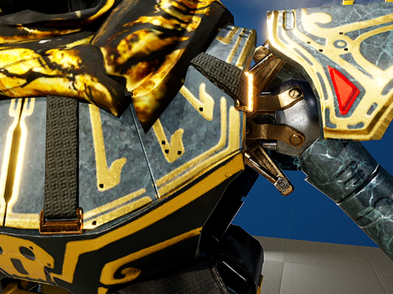
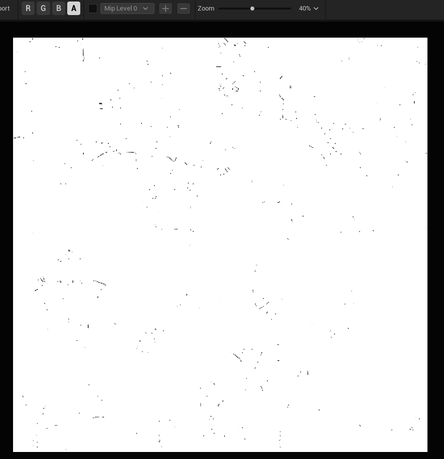
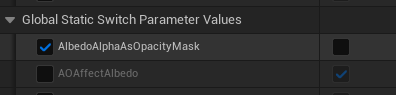
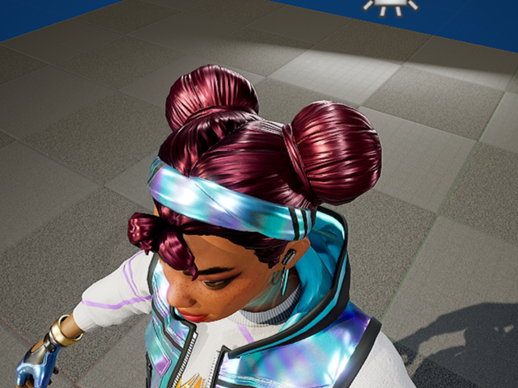
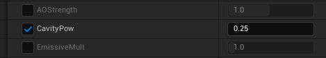
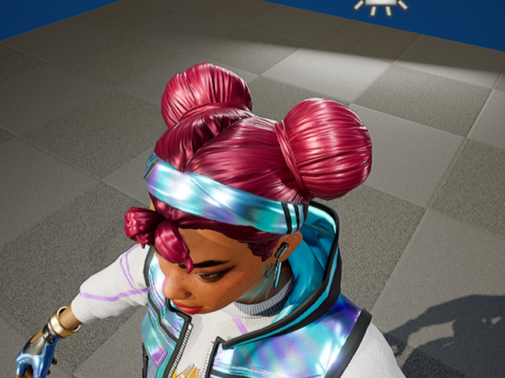
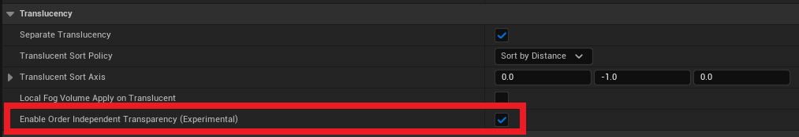
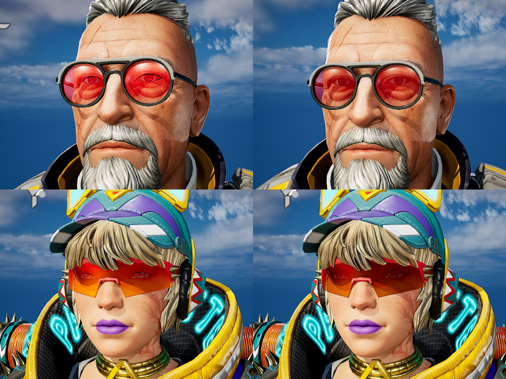

[Sample gif (7MB)](https://github.com/Mstone8370/UE-Substrate-Material-for-ApexLegends-resource/assets/43489974/1aa2e129-bd1f-4f88-92b8-50cace6838a2)

# Unreal Engine Substrate Material for Apex Legends resource

A repository for an Unreal Engine plugin containing Substrate Materials for Apex Legends resources and Utilities.

(Also includes a Post Process Sharpening Material.)

# ***Important Notice***

This project and plugin use ***Substrate***, so you must enable Substrate.
Substrate is a **beta-stage feature** that completely replaces the existing Material system but does not guarantee compatibility.
Therefore, it is recommended not to use this plugin in ongoing projects.

If you really want to use it in an ongoing project, duplicate the project first to create a backup.

Substrate can be enabled in the ```Project Settings``` under **Engine->Rendering->Substrate**.


# About this repository's UE project

This project file includes my **PostProcessVolume** setup and the plugin code.

You can access both the plugin's contents and my **PostProcessVolume** setup by cloning this repository.

If you only want the plugin, it's recommended to download the zipped plugin file from the [release page](https://github.com/Mstone8370/UE-Substrate-Material-for-ApexLegends-resource/releases).

This project's Unreal Engine version is ```5.5```

# Table of Contents

- [Installation](#installation)
  * [By clonning this repository](#by-clonning-this-repository)
  * [By downloading the plugin from release page](#by-downloading-the-plugin-from-release-page)
- [Usage](#usage)
  * [Material](#material)
  * [Auto Texture Mapping tool](#auto-texture-mapping-tool)
  * [Auto Texture Mapping tool with Recolor Skins](#auto-texture-mapping-tool-with-recolor-skins)
  * [Auto Texture Mapping setup](#auto-texture-mapping-setup)
  * [Demo](#demo)
- [Issue Handling](#issue-handling)
  * [Material issues](#material-issues)
  * [Auto Texture Mapping tool issue](#auto-texture-mapping-tool-issue)
  * [Movie Render Queue issue](#movie-render-queue-issue)
- [Experimental Feature](#experimental-feature)

# Installation

## By clonning this repository:

  **Apex Legends Material** plugin may be disabled at first, so make sure to enable it.


## By downloading the plugin from release page:

  Extract the zip file and place the **ApexLegendsMaterial** folder inside your project's ```Plugins``` folder.

  If the ```Plugins``` folder doesn't exist, create a new one.

  After placing the **ApexLegendsMaterial** folder in your project's ```Plugins``` folder, make sure to enable the plugin.

  - As mentioned above, this plugin uses ***Substrate***, which is an experimental feature that completely replaces the existing Material system but does not guarantee compatibility.

    Please be cautious before enabling this plugin, and ensure that Substrate is enabled in the project settings before activating the plugin.

# Usage

## Material

The Master Material is located in ```Plugins/ApexLegendsMaterial/Materials```.

In general, use ```M_Master```, and for translucent materials, use ```M_Master_Translucent```.

It is recommended to create instances of these materials and override the settings.

- For those not using the Auto Texture Mapping tool: Make sure to uncheck sRGB for the AO, cavity, gloss, and alpha mask textures in texture setting. And set the normal map's ```Texture Group``` to ```WorldNormalMap``` and ```Compression Settings``` to ```Normal map```.


## Auto Texture Mapping tool


1. Click the Nessie icon in the toolbar to open the Tool Widget.


2. In the Skeletal Mesh's **Asset Details** pannel, disconnect all Materials if any are connected by default.

   If any materials are connected, this tool will try to change only textures of that material.

   And if that material is not a Master Material from this plugin, the texture settings will be fail.

   If no Materials are connected to this Skeletal Mesh, this tool will create new instances of Master Material, and textures will be connected to those material instances.


3. Create a folder in directory where Skeletal Mesh exists, and import all textures to that folder.

   This tool will search for a folder named ```Textures``` by default, but you can designate another folder name.

4. **Save all** assets before running the Auto Texture Mapping tool.

5. Select the Mesh assets in Contents Browser, and click ```Auto Texture Mapping``` button in the Tool Widget.


  Previous method is still available.


## Auto Texture Mapping tool with **Recolor Skins**

**Recolor Skin** uses a different skin name for the same mesh.

Therefore, you need to change the ```Material Slot Name``` of the mesh to match the name of the **Recolor Skin**.

In the **Change Skin Name** section of the Tool Widget, select the mesh to change the skin name, enter the new skin name, and click the **Change Skin Name** button.

For example, if the ```Material Slot Name``` is ```wraith_lgnd_v19_voidwalker_body```, the skin name is ```lgnd_v19_voidwalker```, and the **Recolor Skin** name will be ```lgnd_v19_voidwalker_rc01``` or ```lgnd_v19_voidwalker_rt01```.

Lastly, run the Auto Texture Mapping tool.


## Auto Texture Mapping setup
  
The settings for the Auto Texture Mapping tool can be changed in the ```BP_AutoTextureMapping``` Blueprint located in ```Plugins/ApexLegendsMaterial/Util```.


## Demo

You can watch the demo of my workflow.

[Auto Texture Mapping tool with recolor skins (v1.2.0)](https://youtu.be/14Dsa7mgJkU)

[Unreal Engine Sequencer work with animations (v1.0.0)](https://youtu.be/UpkA9dgYGuA)

[jx_c_start bone relative motion demo (v1.3.0)](https://youtu.be/UwCY1-t_AIE?si=Wug69pg2aO3KENnq)

# Issue Handling

## Material issues

* Pixelated Artifacts

  If you find pixelated artifacts, the cause might be the alpha channel of the albedo texture.
  
  By default, the alpha channel of the albedo texture is used as an opacity mask, but there can be issues with some alpha channels.

  Therefore, try unchecking the ```AlbedoAlphaAsOpacityMask``` setting in the Material Instance.

  - Artifact example



  Alpha channel
  


  Material Instance setting



  Result


* Hair Color

  If the hair color appears as too dark, lower the ```CavityPow``` value in the Material Instance.

  - Hair example



  CavityPow parameter in Material Instance



  Result



* Translucency Sorting Issue

  When a single mesh has multiple translucent materials, priority sorting may not work correctly, causing the translucent material in the back to cover the one in the front.

  In this case, enable the ```Enable Order Independent Transparency (Experimental)``` option in ```Project Settings``` under **Engine->Rendering->Translucency**.



  In the image below, the left side shows an example with sorting issues, and the right side shows the issue resolved using this option.



## Auto Texture Mapping tool issue

  If the Auto Texture Mapping tool is not working and error logs are printed in the ```Output Log```, the reason might be an old reference issue.

  Try deleting all Material Instances connected to the Skeletal Mesh, and in the content browser, right-click the current folder and select ```Update Redirector References``` to fix the old references.

## Movie Render Queue issue

  When using the Movie Render Queue, there could be an issue where shaders are compiled for every frame.

  This issue can be caused by materials that fail to compile, and Substrate can be the cause of this issue.

  If you find logs in the ```[project path]/Saved/Logs``` folder indicating that material compilation has failed, you will need to fix those materials.

  If those problematic materials belong to an unused plugin, simply disabling that plugin may resolve the issue.

# Experimental Feature

The ```M_Master``` material has an **Anisotropy** option.

Some resources have all the necessary information for anisotropy, resulting in much better outcomes when applied, but in some cases, the necessary information is not enough.

Anisotropy enhances detail, but its effect is subtle, so it is disabled by default.

However, if you want to use it, you can enable it in the **Material Instance** settings, and in some cases, you might need to directly modify the ```M_Master``` Material.

The following images compare the results enabled and disabled the **Anisotropy** option.

Please note that these examples show the most pronounced effect.

The image on the left is without anisotropy (isotropic), right is anisotropy.


